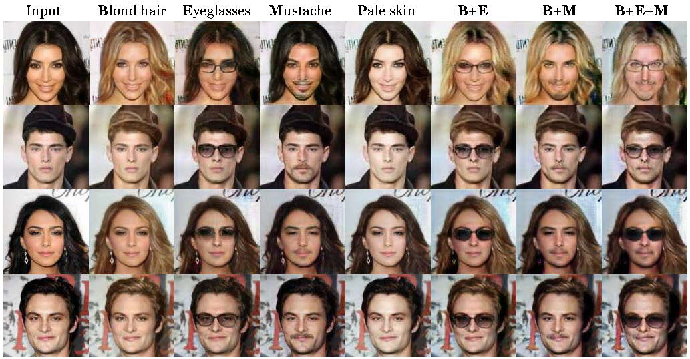
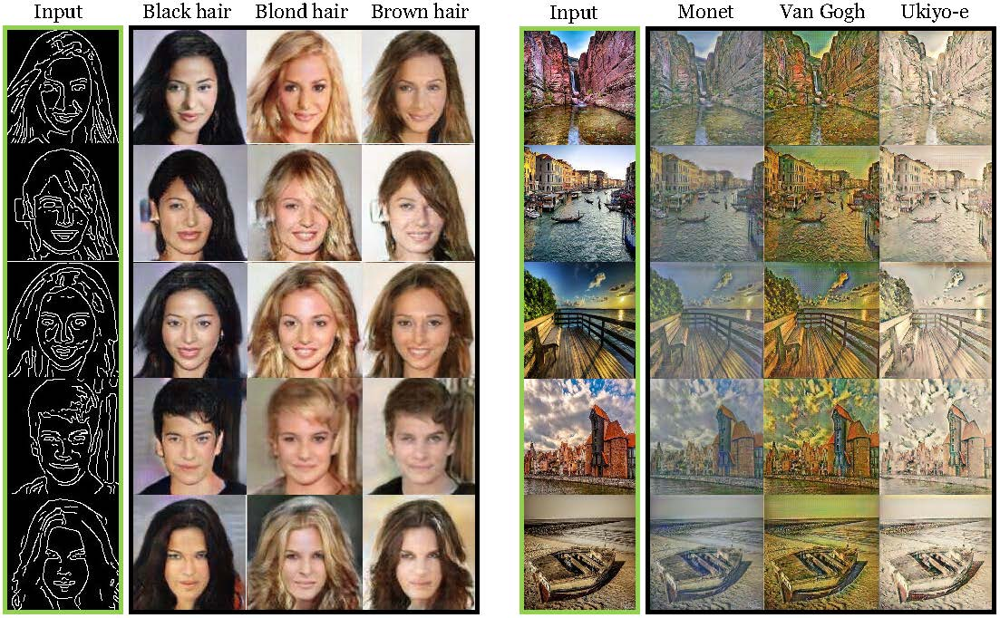

# Multi-marginal Wasserstein GAN

We provide PyTorch implementation for "Multi-marginal Wasserstein GAN". 

<!--   -->

## Paper
[Multi-marginal Wasserstein GAN](https://arxiv.org/abs/1911.00888) \
Jiezhang Cao *, Langyuan Mo *, Yifan Zhang, Kui Jia, Chunhua Shen, Mingkui Tan * \
Advances in Neural Information Processing Systems(NeurIPS), 2019

## Dependencies

* Python3
* PyTorch 1.0.1 
* tensorboardX (optional, need TensorFlow)
* dependencies in requirements.txt

 

## Getting Started

### Installation

1. Clone this repo:

        git clone https://github.com/deepmo24/MWGAN.git
        cd MWGAN

2. Install pytorch and other dependencies.
    * pip install -r requirements.txt
    * tensorboardX and tensorflow are optional for logging

### Data preparation

1. Download the CelebA dataset and corresponding attibute labels.
    * Link: [Dropbox](https://www.dropbox.com/s/d1kjpkqklf0uw77/celeba.zip?dl=0) or [BaiduNetdisk](https://pan.baidu.com/s/18_IHVDbA1PW5ljN_Fg84YA&shfl=sharepset)      
    * Put the data in `./data/celeba` directory

2. Construct the facial attribute translation dataset (i.e. Black_Hair, Blond_Hair, Eyeglasses, Mustache, Pale_Skin).
        
        python data_process.py --process celeba --source_attr Black_Hair

3. Construct the edge -> celeba dataset (i.e. Edge, Black_Hair, Blond_Hair, Brown_Hair).
    * Organize data using folder structure described [here](material/data_structure.md).
        * Get  Black_Hair, Blond_Hair data from **step 2**.

        * Get Brown_Hair data:

                python data_process.py --process celeba \
                    --selected_attrs Brown_Hair --target_dir data/Edge2Celeba

        * Get Edge data:

                python data_process.py --process edge \
                    --source_dir data/Edge2Celeba --target_dir data/Edge2Celeba\
                    --selected_attrs Black_Hair Blond_Hair Brown_Hair --select_nums 15000

### Training

To train MWGAN on facial attribute translation task:

    python main.py --num_domains 5 --batch_size 16 \
        --data_root data/Celeba5domain/train --src_domain Black_Hair \
        --result_root results_celeba \
        --lambda_cls 1 --lambda_info 20 --lambda_idt 10
To train MWGAN on edge->celeba task:

    python main.py --num_domains 4 --batch_size 16 \
        --data_root data/Edge2Celeba/train --src_domain Edge \
        --result_root results_edge \
        --lambda_cls 10 --lambda_info 10 --cls_loss BCE

* if you don't have tensorboardX and tensorflow, please add `--use_tensorboard false`

### Testing

To test MWGAN on facial attribute translation task:

    python main.py --mode test --num_domains 5 --batch_size 16 \
        --data_root data/Celeba5domain/test --src_domain Black_Hair \
        --result_root results_celeba

To test MWGAN on edge->celeba task:

    python main.py --mode test --num_domains 4 --batch_size 16 \
        --data_root data/Edge2Celeba/test --src_domain Edge \
        --result_root results_edge

### Pretrained model

Download the pretrained models.

* Link: [Dropbox](https://www.dropbox.com/sh/vkjo9gh4nx8kk7b/AACwG-F0P30h2AL8GHw5OMaMa?dl=0) or [BaiduNetdisk](https://pan.baidu.com/s/1EL2BEzJyOf0e0MyREPFTwg)
* For facial attribute translation: put the pretrained models in `./celeba_pretrained/models` directory
* For edge->celeba: put the pretrained models in `./edge_pretrained/models` directory

To test MWGAN using the pretrained models:

    python main.py --mode test --num_domains 5 --batch_size 16 \
        --data_root data/Celeba5domain/test --src_domain Black_Hair \
        --result_root celeba_pretrained

or 

    python main.py --mode test --num_domains 4 --batch_size 16 \
        --data_root data/Edge2Celeba/test --src_domain Edge \
        --result_root edge_pretrained

 

## Results

 

## Citation
If this work is useful for your research, please cite our [paper](https://arxiv.org/abs/1911.00888):

    @InProceedings{cao2019mwgan,
    title = {Multi-marginal Wasserstein GAN},
    author = {Cao, Jiezhang and Mo, Langyuan and Zhang, Yifan and Jia, Kui and Shen, Chunhua and Tan, Mingkui},
    booktitle = {Advances in Neural Information Processing Systems},
    year = {2019}
    }

 

## Acknowledgments
Our code is inspired by [StarGAN](https://github.com/yunjey/stargan).